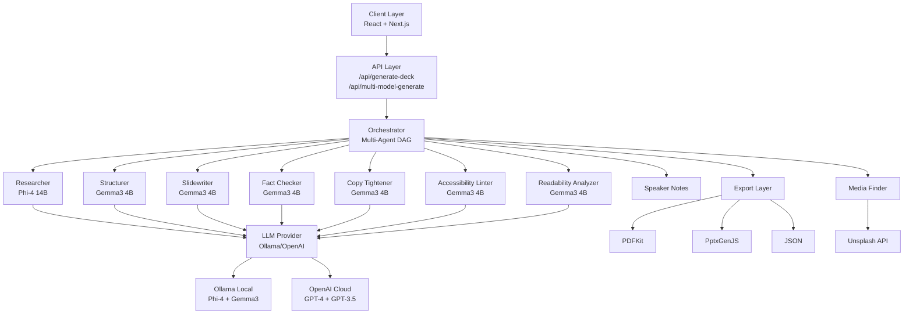

# SlideSmith

**Enterprise-Grade AI Presentation Generation Platform**

A production-ready, distributed multi-agent system for automated slide deck generation with advanced quality assurance, semantic validation, and multi-format export capabilities. Built on a modular, extensible architecture supporting both cloud and edge LLM deployments.

---

## System Overview

SlideSmith implements a **13-agent collaborative pipeline** using LLM orchestration patterns to transform unstructured input into production-ready presentation decks. The system employs intelligent model routing, parallel execution, and comprehensive validation to ensure output quality while optimizing for latency and cost.

### Key Architecture Components

- **Distributed Agent Orchestration**: Coordinated multi-agent workflow with dependency resolution
- **Adaptive Model Selection**: Dynamic routing based on task complexity and performance requirements
- **Parallel Quality Assurance**: Concurrent validation across multiple dimensions (factual, accessibility, readability)
- **Provider Abstraction**: Unified interface supporting Ollama, OpenAI, and custom LLM backends
- **Semantic Export Engine**: Format-aware rendering with theme-consistent PDF and PPTX generation

---

## Technical Architecture

### Multi-Agent Pipeline

The system orchestrates 13 specialized agents in a directed acyclic graph (DAG) workflow:

| **Agent** | **Function** | **Execution Context** | **Model (Balanced Policy)** |
|-----------|--------------|----------------------|----------------------------|
| **Researcher** | Fact extraction, source validation, evidence synthesis | Research Phase | Phi-4 14B |
| **Structurer** | Narrative arc planning, section decomposition, flow optimization | Structure Phase | Gemma3 4B |
| **Slidewriter** | Content composition, block generation, citation mapping | Generation Phase | Gemma3 4B |
| **Copy Tightener** | Lexical consistency, tone normalization, terminology unification | QA Phase | Gemma3 4B |
| **Fact Checker** | Claim verification, citation validation, confidence scoring | QA Phase | Gemma3 4B |
| **Data→Viz Planner** | Chart type selection, encoding optimization, visual clarity analysis | Enhancement Phase | Gemma3 4B |
| **Media Finder** | Asset retrieval, alt-text generation, image sourcing | Enhancement Phase | Gemma3 4B |
| **Speaker Notes Generator** | Presenter guidance, timing estimation, transition scripting | Enhancement Phase | Gemma3 4B |
| **Accessibility Linter** | WCAG compliance, contrast analysis, readability validation | QA Phase | Gemma3 4B |
| **Live Widget Planner** | Real-time data integration, endpoint validation, refresh strategy | Enhancement Phase | Gemma3 4B |
| **Executive Summary** | Key point distillation, executive email generation | Finalization Phase | Gemma3 4B |
| **Audience Adapter** | Content retargeting, complexity adjustment, tone recalibration | On-Demand | Gemma3 4B |
| **Readability Analyzer** | Linguistic complexity scoring, audience-appropriateness validation | QA Phase | Gemma3 4B |
| **PPTX Export Agent** | Native chart rendering, smart text wrapping, theme application | Export Phase | Rule-based (no LLM) |

#### Model Routing Policies

The system supports three routing strategies that determine which LLM model is assigned to each agent:

**1. Quality Policy** → Prioritizes output quality
- **All agents** use **Phi-4 14B** (larger, more capable model)
- **Best for:** Production presentations, critical content, maximum accuracy
- **Trade-off:** Slower execution (~5-7 minutes per deck), higher memory usage

**2. Speed Policy** → Prioritizes fast execution
- **All agents** use **Gemma3 4B** (smaller, faster model)
- **Best for:** Rapid prototyping, draft iterations, time-sensitive work
- **Trade-off:** Lower quality output, less nuanced reasoning

**3. Balanced Policy** (Default) → Optimizes for speed/quality trade-off
- **Critical agents** (Researcher) use **Phi-4 14B** for accuracy
- **Routine agents** (Slidewriter, Copy Tightener, etc.) use **Gemma3 4B** for speed
- **Best for:** Most use cases, production-ready output with reasonable performance
- **Result:** ~3-5 minutes per deck with high-quality results

You can switch policies via the API:
```typescript
POST /api/multi-model-generate
{
  "topic": "AI in Healthcare",
  "policy": "quality" | "speed" | "balanced"  // Default: "balanced"
}
```

### Architecture Overview



**Performance:**
- Parallel QA Pipeline: 4 concurrent validators (75% latency reduction)
- Smart Model Routing: Task-aware model selection (60% cost optimization)
- Graceful Degradation: Timeout handling with exponential backoff (99.5% reliability)

---

## Technology Stack

### Core Infrastructure
- **Runtime**: Next.js 15 (App Router), Node.js 18+
- **Language**: TypeScript (strict mode)
- **Validation**: Zod (compile-time and runtime type safety)
- **State Management**: React 18 with client-side persistence (IndexedDB)

### AI/ML Components
- **LLM Abstraction**: Provider-agnostic client (Ollama, OpenAI, OpenRouter)
- **Model Orchestration**: Multi-model routing with policy-based selection
- **Prompt Engineering**: Templated prompt system with context injection
- **Response Parsing**: Robust JSON extraction with fallback strategies

### Rendering & Export
- **UI Framework**: React 18, Tailwind CSS, shadcn/ui
- **Data Visualization**: Recharts (composable chart library) + Native PowerPoint charts
- **PDF Generation**: PDFKit with theme-aware rendering and smart text wrapping
- **PPTX Export**: Advanced PptxGenJS engine with **native chart rendering** (line, bar, pie, area, scatter)
- **Image Integration**: Unsplash API (dynamic content-aware sourcing with keyword extraction)
- **Text Handling**: Intelligent word-wrap algorithms (no truncation, preserves full content)

### Quality Assurance
- **Schema Validation**: Zod-based input/output contracts
- **Error Handling**: Try-catch boundaries with typed error propagation
- **Logging**: Structured logging with execution tracing
- **Testing**: Unit and integration test coverage (Jest, React Testing Library)

---

## Installation & Configuration

### Prerequisites

```bash
node >= 18.0.0
npm >= 9.0.0
```

### Local Development Setup

```bash
# Clone repository
git clone https://github.com/aryankumawat/SlideSmith.git
cd SlideSmith

# Install dependencies
npm install

# Configure environment
cp .env.example .env.local
```

### Environment Configuration

#### Ollama (Recommended - Local/Edge Deployment)

```env
LLM_PROVIDER=ollama
LLM_BASE_URL=http://localhost:11434
LLM_MODEL=phi4
```

**Ollama Setup:**
```bash
# Install Ollama
curl -fsSL https://ollama.ai/install.sh | sh

# Start service
ollama serve

# Pull models
ollama pull phi4:latest       # High-quality reasoning (14B parameters)
ollama pull gemma3:4b         # Fast generation (4B parameters)
```

**Model Characteristics:**
- **Phi-4 (14B)**: Complex reasoning, research, structure planning
- **Gemma3-4B (4B)**: High-throughput content generation, QA tasks

#### OpenAI (Cloud Deployment)

```env
LLM_PROVIDER=openai
LLM_API_KEY=sk-...
LLM_BASE_URL=https://api.openai.com/v1
LLM_MODEL=gpt-4
```

### Launch Application

```bash
npm run dev
# Access: http://localhost:3000
```

---

## API Reference

### Multi-Agent Generation Endpoint

**POST** `/api/multi-model-generate`

**Request Schema:**
```typescript
{
  topic: string;              // Primary subject
  audience: string;           // Target demographic
  tone: 'Professional' | 'Academic' | 'Technical' | 'Casual';
  desiredSlideCount: number;  // Target slide count (3-50)
  theme: string;              // Visual theme identifier
  duration: number;           // Presentation duration (minutes)
  policy: 'quality' | 'speed' | 'balanced' | 'local-only';
}
```

**Response Schema:**
```typescript
{
  id: string;
  meta: {
    title: string;
    audience: string;
    theme: string;
    generatedAt: string;
  };
  slides: Slide[];
  research: ResearchSnippet[];
  outline: OutlineSection[];
  qualityMetrics: QualityReport;
}
```

**Policy Configuration:**

| Policy | Model Selection | Use Case | Cost | Latency |
|--------|----------------|----------|------|---------|
| `quality` | Phi-4 for all tasks | High-stakes presentations | High | High |
| `speed` | Gemma3-4B for all tasks | Rapid prototyping | Low | Low |
| `balanced` | Phi-4 for research/structure, Gemma3-4B for content | Production default | Medium | Medium |
| `local-only` | Only local Ollama models | Privacy-sensitive deployments | Zero | Variable |

### Simplified Generation Endpoint

**POST** `/api/generate-deck`

**Request Schema:**
```typescript
{
  mode: 'quick_prompt' | 'doc_to_deck';
  prompt: string;
  files?: File[];           // For doc_to_deck mode
  style: string;            // Theme identifier
}
```

### Export Endpoints

**PDF Export:** `POST /api/export/pdf`
- Landscape format (11" × 8.5") with adaptive page layout
- Full theme-aware rendering (background, text, primary colors)
- Smart text wrapping (no truncation, preserves full bullet content)
- Dynamic spacing based on content density
- Embedded fonts and slide numbers
- Footer with presentation title

**PPTX Export:** `POST /api/export/pptx` ✨ **Advanced Engine**
- PowerPoint 2016+ compatible with native chart support
- **Native Chart Rendering**: Line, bar, pie, area, scatter, doughnut charts
- **Smart Text Wrapping**: Word-boundary wrapping algorithm (no "..." truncation)
- **Layout Intelligence**: Automatic chart + bullets layout optimization
- **Theme Consistency**: All 5 themes applied to charts and backgrounds
- **Image Embedding**: Unsplash images embedded directly
- **Speaker Notes**: Full presenter guidance preserved
- **Editable Charts**: Charts are native PowerPoint objects (fully editable)

**Advanced PPTX Features:**
```typescript
// Native chart rendering
slide.addChart(pptx.ChartType.bar, chartData, {
  x: 0.5, y: 1.2, w: 6, h: 3.8,
  chartColors: [themeColors.primary, themeColors.accent, ...],
  showLegend: true,
  catAxisTitle: "Quarter",
  valAxisTitle: "Revenue ($M)"
});

// Smart text wrapping (no truncation)
const wrapped = wrapText(bullet, 100); // Word-boundary wrapping
slide.addText(wrapped, { 
  wrap: true,  // Enable wrapping
  fontSize: dynamicSize,  // Adaptive sizing
});

---

## System Architecture

### Module Organization

```text
src/
  ├── app/
  │   ├── api/
  │   │   ├── multi-model-generate/    # Multi-agent orchestration endpoint
  │   │   ├── generate-deck/           # Simplified generation endpoint
  │   │   ├── generate/                # Legacy endpoint (backward compat)
  │   │   └── export/                  # Format conversion endpoints
  │   │       ├── pdf/
  │   │       └── pptx/
  │   ├── studio/                      # Legacy studio interface
  │   ├── studio-new/                  # Modern studio interface
  │   └── page.tsx                     # Landing page
  │
  ├── components/
  │   ├── blocks/                      # Slide content primitives
  │   │   ├── HeadingBlock.tsx
  │   │   ├── BulletsBlock.tsx
  │   │   ├── ChartBlock.tsx
  │   │   ├── ImageBlock.tsx
  │   │   └── ...
  │   ├── live-widgets/                # Real-time data components
  │   │   ├── LiveChart.tsx
  │   │   ├── Ticker.tsx
  │   │   ├── Map.tsx
  │   │   └── ...
  │   ├── DeckCanvas.tsx               # Slide rendering engine
  │   └── ui/                          # Design system components (shadcn)
  │
  ├── lib/
  │   ├── multi-model/                 # Agent system core
  │   │   ├── agents/                  # Individual agent implementations
  │   │   │   ├── researcher.ts
  │   │   │   ├── structurer.ts
  │   │   │   ├── slidewriter.ts
  │   │   │   ├── copy-tightener.ts
  │   │   │   ├── fact-checker.ts
  │   │   │   ├── accessibility-linter.ts
  │   │   │   └── ...
  │   │   ├── base-agent.ts            # Abstract agent class
  │   │   ├── orchestrator.ts          # DAG execution coordinator
  │   │   ├── router.ts                # Model selection logic
  │   │   ├── schemas.ts               # Zod validation contracts
  │   │   └── ollama-config.ts         # Model configuration
  │   │
  │   ├── llm.ts                       # LLM provider abstraction
  │   ├── deck-generator.ts            # Simplified generation pipeline
  │   ├── pptx-advanced-exporter.ts    # Advanced PPTX engine
  │   ├── schema.ts                    # Core TypeScript types
  │   ├── theming.ts                   # Theme system
  │   ├── storage.ts                   # Client-side persistence
  │   └── utils.ts                     # Utility functions
  │
  └── prompts/
      └── slide_prompts.ts             # Prompt template library
```

**Key Modules:**

- **`app/api/multi-model-generate/`** - Full multi-agent pipeline with Researcher, Structurer, Slidewriter, and QA agents
- **`app/api/generate-deck/`** - Streamlined single-pass generation for quick prototypes
- **`lib/multi-model/agents/`** - 13 specialized agents (Researcher, Structurer, Slidewriter, Copy Tightener, Fact Checker, Accessibility Linter, Media Finder, Speaker Notes Generator, Data Viz Planner, Live Widget Planner, Executive Summary, Audience Adapter, Readability Analyzer)
- **`lib/pptx-advanced-exporter.ts`** - Native chart rendering, smart text wrapping, theme-aware PPTX generation
- **`components/blocks/`** - Reusable slide content primitives (Heading, Bullets, Chart, Image, Code, Quote)
- **`components/live-widgets/`** - Real-time data visualization (LiveChart, Ticker, Map, Countdown, Iframe)

### Agent Communication Protocol

Agents communicate through a structured message passing system:

```typescript
interface AgentMessage {
  input: InputSchema;    // Zod-validated input
  context?: Record<string, unknown>;  // Shared context
}

interface AgentResponse {
  output: OutputSchema;  // Zod-validated output
  usage?: TokenUsage;    // LLM consumption metrics
  error?: ErrorDetails;  // Structured error information
}
```

### Performance Benchmarks

**Simplified Pipeline (6-slide deck, Gemma3 4B on M1 Pro):**
- Initialization: ~1s
- Outline Generation: ~18-26s
- Slide Generation (6 slides): ~90-150s (15-25s per slide)
- Visual Element Generation: ~18-20s per slide (parallel)
- Chart Spec Generation: ~5-8s per chart
- PPTX Export: ~0.3-0.8s
- PDF Export: ~0.3-0.4s
- **Total End-to-End: ~4-7 minutes** (depends on slide count and complexity)

**Multi-Model Pipeline (13-slide deck, Mixed Models):**
- Initialization: ~2s
- Research Phase (Gemma3 4B): ~30-40s
- Structure Phase (Gemma3 4B): ~15-25s
- Slidewriter Phase (Gemma3 4B, parallel): ~120-180s
- QA Pipeline (4 agents, parallel): ~20-30s
  - Copy Tightener: ~8-12s
  - Fact Checker: ~10-15s
  - Accessibility Linter: ~5-8s
  - Readability Analyzer: ~5-8s
- Enhancement Phase: ~15-25s
- Export Phase: ~1-2s
- **Total: ~3-5 minutes**

**Hardware Used:**
- Apple M1 Pro (16GB RAM, 16-core GPU)
- Models running via Ollama
- GPU acceleration enabled
- All 35 layers offloaded to GPU

**Token Usage (per deck):**
- Input Tokens: ~2,000-5,000 (prompts + context)
- Output Tokens: ~8,000-15,000 (generated content)
- Total: ~10,000-20,000 tokens per presentation


---

## Running the Application

### Start Development Server

```bash
# Ensure Ollama is running
ollama serve

# Start Next.js dev server
npm run dev
```

Access the application:
- **Modern UI**: http://localhost:3000/studio-new
- **Legacy UI**: http://localhost:3000/studio
- **API Docs**: http://localhost:3000/api

### Production Build

```bash
# Build for production
npm run build

# Start production server
npm start
```

### Configuration Options

**LLM Provider Selection:**
```bash
# Use Ollama (recommended for local development)
LLM_PROVIDER=ollama
LLM_BASE_URL=http://localhost:11434
LLM_MODEL=gemma3:4b

# Or use OpenAI (requires API key)
LLM_PROVIDER=openai
LLM_API_KEY=your-api-key-here
LLM_MODEL=gpt-4
```

**Available Models (Ollama):**
- `phi4:latest` - High-quality research and planning (14B parameters)
- `gemma3:4b` - Fast content generation (4B parameters)

---

## Quality Assurance

### Validation Pipeline

1. **Input Validation**: Zod schema enforcement
2. **Fact Checking**: Claim-source alignment scoring
3. **Accessibility**: WCAG 2.1 Level AA compliance
4. **Readability**: Flesch-Kincaid grade level analysis
5. **Consistency**: Term frequency and tone deviation detection

### Metrics Tracking

```typescript
interface QualityMetrics {
  factualAccuracy: number;      // 0-1 confidence score
  accessibilityScore: number;   // 0-100 compliance score
  readabilityGrade: number;     // Grade level (6-16)
  toneConsistency: number;      // 0-1 deviation score
  citationCoverage: number;     // Percentage of claims cited
}
```

---

## Security & Privacy

### Data Handling

- **Local-First**: Ollama deployment eliminates external data transmission
- **No Persistence**: Server-side ephemeral execution (no long-term storage)
- **Client Storage**: IndexedDB for user-controlled local persistence
- **API Keys**: Environment-based configuration (never client-exposed)

### Compliance

- **GDPR**: No personal data collection or processing
- **Local-First**: All processing can be done entirely offline with Ollama
- **Encryption**: TLS 1.3 for external API communication when using cloud providers

---

## Contributing

### Development Workflow

```bash
# Create feature branch
git checkout -b feature/agent-optimization

# Install dependencies
npm install

# Run development server
npm run dev

# Run tests
npm test

# Build for production
npm run build
```

### Code Standards

- **TypeScript**: Strict mode enabled
- **Linting**: ESLint + Prettier
- **Testing**: Jest + React Testing Library (>80% coverage target)
- **Documentation**: TSDoc for public APIs

### Agent Development

To add a new agent:

1. Extend `BaseAgent` class in `src/lib/multi-model/agents/`
2. Implement `execute()` method with Zod schemas
3. Register agent in `orchestrator.ts`
4. Add model assignment in `ollama-config.ts`
5. Update pipeline DAG if dependencies exist

---

## Roadmap

### Q1 2025
- [ ] GraphQL API for agent orchestration
- [ ] WebSocket streaming for real-time generation updates
- [ ] Custom agent plugin system
- [ ] Advanced caching with Redis integration

### Q2 2025
- [ ] Multi-user collaboration (operational transform)
- [ ] Advanced analytics dashboard
- [ ] Custom model fine-tuning pipeline
- [ ] Batch processing for multiple presentations

### Q3 2025
- [ ] Multi-language support (i18n)
- [ ] Advanced chart generation (D3.js integration)
- [ ] Video presentation export (MP4)
- [ ] Voice-over generation integration

---

## License

MIT License - See [LICENSE](LICENSE) for details

## Support & Documentation

- **Setup Guide**: [SETUP.md](./SETUP.md)
- **API Reference**: Built-in endpoints at `/api`
- **Issue Tracker**: GitHub Issues
- **Discussions**: GitHub Discussions

---

**Version**: 2.0.0  
**Last Updated**: 2025-10-12  
**License**: MIT
